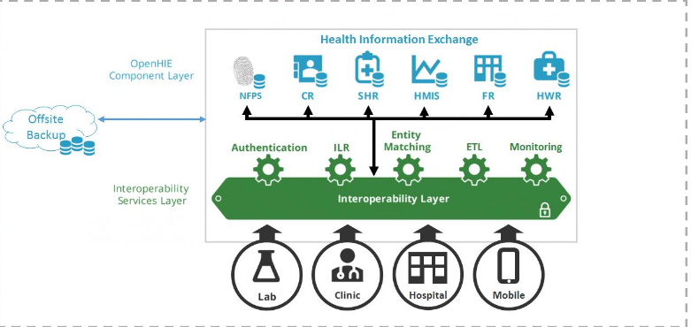
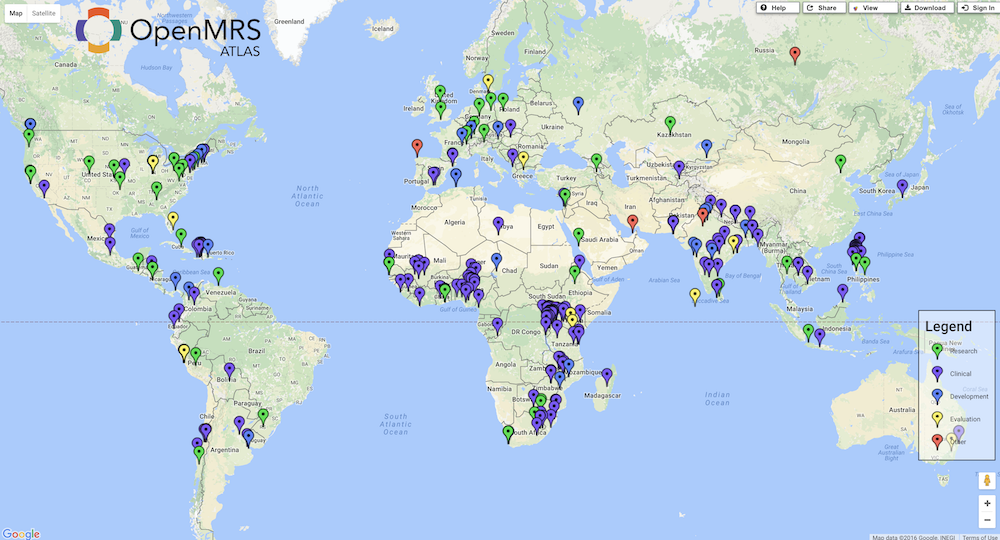
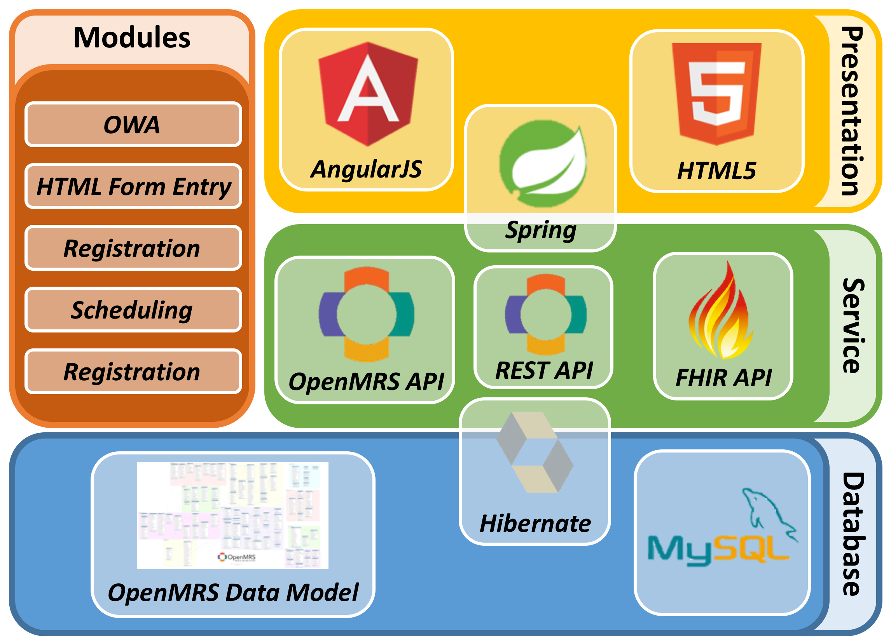
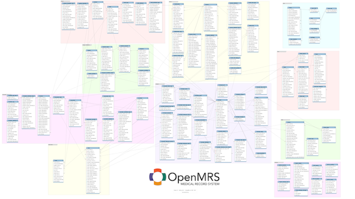
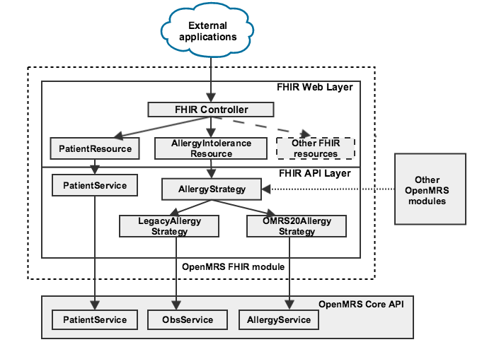
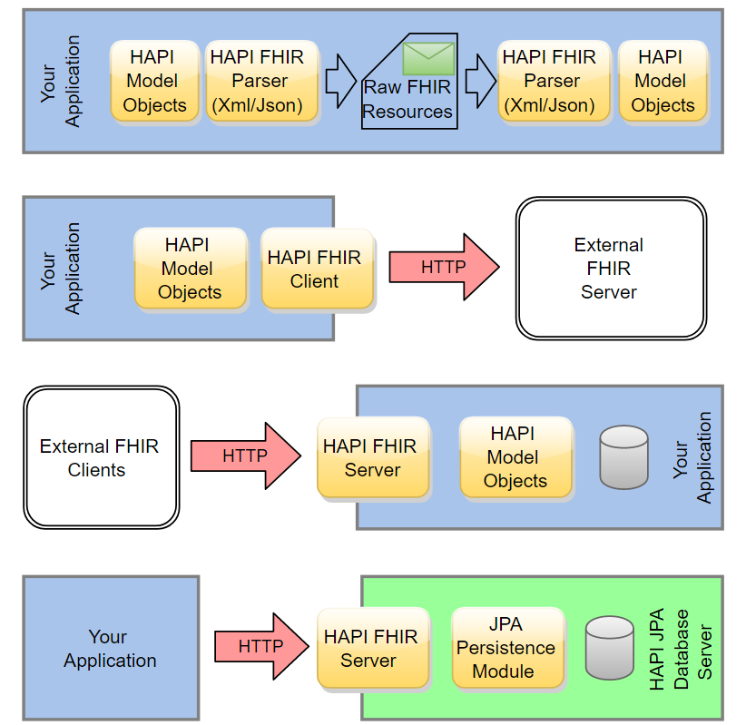

# Consumer and Global Health on FHIR
**October 23, 2019**  
[**Seattle on FHIR Meetup**](https://www.meetup.com/Seattle-on-FHIR/events/265698879/)  

Link to Video: https://youtu.be/McQO6biEInw

---

**Table Of Contents**
- [Consumer and Global Health on FHIR](#consumer-and-global-health-on-fhir)
  - [Talk #1: Mobile Patient Reported Outcomes (PROs) with FHIR](#talk-1-mobile-patient-reported-outcomes-pros-with-fhir)
  - [Talk #2:](#talk-2)
  - [Talk #3: The Modernization of the Haiti Health Information System](#talk-3-the-modernization-of-the-haiti-health-information-system)
      - [SEDISH - Système d’Échange d’Information Sanitaire Haïtien](#sedish---syst%c3%a8me-d%c3%89change-dinformation-sanitaire-ha%c3%aftien)
      - [IsantePlus](#isanteplus)
      - [OpenMRS - an open-source EMR](#openmrs---an-open-source-emr)
      - [The OpenMRS FHIR Module](#the-openmrs-fhir-module)
      - [The OpenMRS FHIR Squad](#the-openmrs-fhir-squad)
---
## Talk #1: Mobile Patient Reported Outcomes (PROs) with FHIR
**[Hannah Burkhardt](https://hannahburkhardt.github.io/)**

**Summary**  
We are developing a mobile consumer health application using FHIR intended to support users following an at-home treatment plan aiming to alleviate certain symptoms. Users’ (subjective impressions of) symptoms are captured longitudinally through regularly scheduled questionnaires. The application displays a Careplan in calendar form that the user can use to keep track of scheduled treatment events/sessions (such as certain exercises, e.g. fitness or physical therapy type exercises, mindfulness exercises for mental health, etc.) as well as scheduled questionnaires, and reminds the user when it’s time to assess progress or complete an exercise. The app also allows viewing progress over time in charts. Future plans include integrating with other devices, e.g. over bluetooth, to collect objective observations in addition to the subjective questionnaire data, e.g. blood pressure, activity data, etc. The current main use case related to pelvic floor issues experienced particularly by post-menopausal women, for which certain regular exercises may help. Issues include urinary incontinence issues, vaginal dryness/discomfort, etc. The application is intended to be foundational for several projects we have in mind, so we want to design it to be general enough to cover other health issues as well. I’m currently using a HAPI FHIR server and am using Patient, CarePlan, Questionnaire, and Procedure resources (among others). On the client side I am using flutter, which is a cross-platform mobile application development framework.Challenges we are facing right now include offline-first operation, for which we are looking into couchbase, which allows storage of FHIR resources in a local database (on the smartphone) that is synced with a server-side installation of couchbase. If WiFi is lost in this setup, the application should be able to function normally, and will sync up with the server when connectivity is restored. We have yet to figure out whether this server-side database can be a HAPI FHIR server or if we need to copy data over to the FHIR server, or something else. Another potential challenge is authorization, as we are using an external identify provider service (keycloak) and have yet to figure out how to authenticate the FHIR server and also link the keycloak user account to the appropriate FHIR patient resource. Currently we have added an entry to the identifier field on the patient object that has the keycloak user ID, but I’m wondering if that’s a good idea or if there are other approaches we could consider. I’d also like input on the careplan fhir resource design, since I’m not sure if Procedure is the best choice. Regarding offline-first FHIR apps (mobile or otherwise) I’m curious if people have input as well.

**Presentation**  
[Download the Slides Here](hannah_consumer_health.pptx)

---

## Talk #2: 

**Summary**

**Useful Links**

---

## Talk #3: The Modernization of the Haiti Health Information System
**[Piotr Mankowski](https://github.com/pmanko)**

**Background:**
Haitian Ministry of health engaged the UW in 2008 to develop EMR and a basic health architecture. This architecture 
proved to work well for over a decade, including during the earthquake crisis in 2010, and established interoperability as
a priority for improving care and treatment programs in global health.

Since then, the underlying technology stack and architecture of the system have grown outdated. This project aims to modernize
these systems, align them with modern health data standards like FHIR, leverege existing efforts in solving these usecases, and expand the data interoperability capabilities of the Health Information System. 

**Useful Links**  
https://wiki.ohie.org/display/projects/Haiti

**Walkthrough**

Objectives:
- Rollout of EMR updates to clinics around Haiti
- Interoperability with laboratory information systems
- Patient identification and a Master Patient Index
- Shared Health Record for transfer of care
- A National Data Repository for aggregate level reporting
- Building a Community of Practice for adoption, feedback, long-term sustainability

#### SEDISH - Système d’Échange d’Information Sanitaire Haïtien
- http://www.go2itech.org/wp-content/uploads/2017/04/SOW_RFQ-SEDISH-FY19_final.pdf
- https://github.com/SEDISH

#### IsantePlus
- https://github.com/IsantePlus
- https://talk.openmrs.org/t/notes-on-isanteplus-activity-and-push-pull-architecture-with-sedish/15128
- https://github.com/IsantePlus/openmrs-module-isanteplus

A customized distribution of the [OpenMRS Reference Application v2.5](https://wiki.openmrs.org/display/docs/Reference+Application+2.5) developed for the Haiti Health System.

#### OpenMRS - an open-source EMR

**Guide:** http://guide.openmrs.org/en/

**Developer Manual:** http://devmanual.openmrs.org/en/

**Wiki:** https://wiki.openmrs.org/

**OpenMRS Talk:** https://talk.openmrs.org/

**Overview of Architecture**  
http://devmanual.openmrs.org/en/Technology/architecture.html 

**Modularity**  

**Hibernate ORM:** http://devmanual.openmrs.org/en/Technology/architecture.html#hibernate

**Spring MVC Framework**  
- http://devmanual.openmrs.org/en/Technology/architecture.html#spring-mvc
- https://docs.spring.io/spring/docs/current/spring-framework-reference/web.html

**The OpenMRS Data Model**
- http://guide.openmrs.org/en/Getting%20Started/openmrs-information-model.html
- https://wiki.openmrs.org/display/docs/Data+Model
- http://devmanual.openmrs.org/en/Technology/dataModel.html

#### The OpenMRS FHIR Module
- https://wiki.openmrs.org/display/projects/OpenMRS+FHIR+Module
- Data Mappings: https://wiki.openmrs.org/display/projects/Proposed+OpenMRS+Domain+Object+to+FHIR+Resource+Mapping
- OpenMRS Module FHIR Support: https://wiki.openmrs.org/display/projects/OpenMRS+FHIR+Module#OpenMRSFHIRModule-CurrentstatusofFHIRsupport

**Overview**

**Code Study: Serving a Patient Resource**

1. https://github.com/openmrs/openmrs-module-fhir/tree/master/api/src/main/java/org/openmrs/module/fhir/api

2. https://github.com/openmrs/openmrs-module-fhir/blob/master/api/src/main/java/org/openmrs/module/fhir/api/util/FHIRPatientUtil.java

3. Compare https://hapifhir.io/apidocs-dstu3/org/hl7/fhir/dstu3/model/Patient.html and http://hl7.org/fhir/STU3/patient.html

4. https://github.com/openmrs/openmrs-module-fhir/blob/master/api/src/main/java/org/openmrs/module/fhir/api/strategies/patient/PatientStrategy.java
   

#### The OpenMRS FHIR Squad 
https://talk.openmrs.org/t/welcoming-the-openmrs-fhir-squad/25068

**HAPI FHIR and Smile CDR**
http://hapifhir.io/

**Hearth**
- https://github.com/jembi/hearth
- https://github.com/jembi/hearth/wiki/IHE-services
- https://hub.docker.com/r/jembi/hearth

